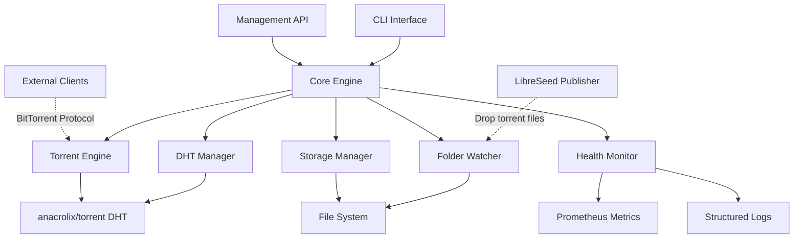
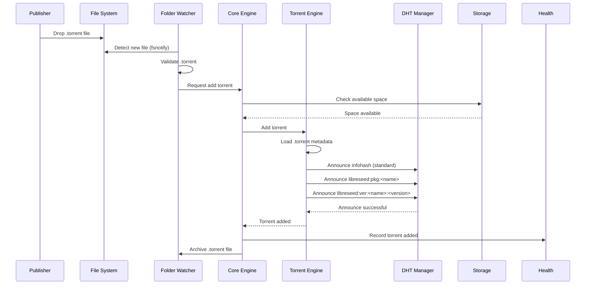
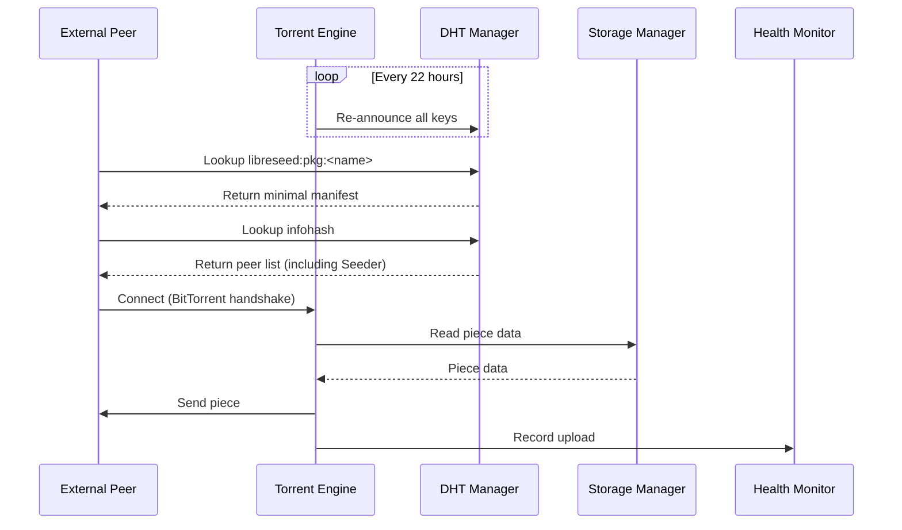

# LibreSeed Seeder Architecture

**Version:** 1.0  
**Status:** Draft  
**Last Updated:** 2025-01-27  
**Language:** en-US

---

## Executive Summary

The LibreSeed Seeder is a Go-based daemon that automatically discovers, seeds, and maintains LibreSeed packages via BitTorrent and DHT. It operates in two primary modes:

1. **Shared Folder Mode**: Monitors a directory for `.torrent` files dropped by LibreSeed Publishers
2. **Direct Mode**: Seeds explicitly configured torrents via CLI or API

The Seeder integrates with the standard BitTorrent ecosystem while supporting LibreSeed's custom DHT key scheme for decentralized package discovery.

### Key Design Principles

- **BitTorrent Compatibility**: Standard BitTorrent clients can participate in swarms
- **DHT Integration**: Custom LibreSeed DHT keys coexist with standard infohash announces
- **Zero-Configuration**: Drop `.torrent` files and auto-seed
- **Resource Management**: Configurable bandwidth, storage, and connection limits
- **Observability**: Health monitoring, metrics, and logging

---

## System Architecture

### High-Level Architecture



### Component Overview

| Component | Responsibility | Technology |
|-----------|---------------|------------|
| **CLI Interface** | User commands, configuration management | `spf13/cobra` |
| **Core Engine** | Orchestration, lifecycle management | Custom Go |
| **DHT Manager** | LibreSeed DHT key management, announces | `anacrolix/torrent` + custom layer |
| **Torrent Engine** | BitTorrent protocol, seeding, peer management | `anacrolix/torrent` |
| **Folder Watcher** | `.torrent` file discovery, auto-add | `fsnotify/fsnotify` |
| **Storage Manager** | Disk I/O, cache management, cleanup | Custom Go |
| **Health Monitor** | Metrics, logging, status reporting | `prometheus/client_golang` |
| **Management API** | HTTP API for runtime control | `net/http` + `gorilla/mux` |

---

## Component Architecture

### 1. CLI Interface

**Responsibility**: User-facing command-line interface for seeder control.

**Commands**:
```
libreseed-seeder start [--config FILE]
libreseed-seeder stop
libreseed-seeder add <torrent-file>
libreseed-seeder remove <infohash>
libreseed-seeder list
libreseed-seeder status
libreseed-seeder config validate
```

**Technology**: `spf13/cobra` for CLI framework, `spf13/viper` for configuration loading.

**Interface**:
```go
type CLI interface {
    Execute() error
    LoadConfig(path string) (*Config, error)
}
```

### 2. Core Engine

**Responsibility**: Central orchestrator managing component lifecycle, event routing, and shutdown coordination.

**Key Functions**:
- Initialize and coordinate all subsystems
- Handle graceful shutdown (SIGTERM, SIGINT)
- Manage configuration reloads
- Route events between components
- Enforce resource limits

**Interface**:
```go
type CoreEngine interface {
    Start(ctx context.Context) error
    Stop() error
    AddTorrent(torrentFile string) error
    RemoveTorrent(infohash string) error
    GetStatus() Status
}

type Status struct {
    Uptime        time.Duration
    ActiveTorrents int
    TotalUploaded  int64
    TotalDownloaded int64
    DHTNodes       int
}
```

### 3. DHT Manager

**Responsibility**: Manage LibreSeed's custom DHT key scheme while maintaining standard DHT announces.

**LibreSeed DHT Keys**:
- `libreseed:pkg:<name>` → Minimal manifest (mutable)
- `libreseed:ver:<name>:<version>` → Version-specific manifest (immutable)
- `libreseed:announce:<pubkey>` → Publisher's package list

**Announce Strategy**:
1. Standard infohash announce (for BitTorrent compatibility)
2. LibreSeed package key announce (`libreseed:pkg:<name>`)
3. LibreSeed version key announce (`libreseed:ver:<name>:<version>`)

**Re-announce Interval**: 22 hours (as per spec §3.2)

**Interface**:
```go
type DHTManager interface {
    AnnouncePackage(pkg PackageInfo) error
    GetPackage(name string) (*DHTManifest, error)
    GetVersion(name, version string) (*DHTManifest, error)
    GetPublisherAnnounce(pubkey string) ([]string, error)
}

type DHTManifest struct {
    Infohash  string
    Size      int64
    Timestamp time.Time
}
```

**Implementation Notes**:
- Use `anacrolix/torrent` DHT client with custom key encoding
- LibreSeed keys are SHA-1 hashed for DHT compatibility
- Minimal manifest stored in DHT (~500 bytes)
- Full `.torrent` file retrieved via BitTorrent

### 4. Torrent Engine

**Responsibility**: BitTorrent protocol implementation, seeding, and peer management.

**Key Functions**:
- Load and seed `.torrent` files
- Manage peer connections and piece distribution
- Enforce bandwidth and connection limits
- Support both standard and LibreSeed-aware clients

**Technology**: `anacrolix/torrent` library

**Interface**:
```go
type TorrentEngine interface {
    AddTorrentFromFile(path string) (*Torrent, error)
    AddTorrentFromMagnet(magnet string) (*Torrent, error)
    RemoveTorrent(infohash string) error
    ListTorrents() []*Torrent
    GetTorrentStats(infohash string) (*TorrentStats, error)
}

type Torrent struct {
    Infohash   string
    Name       string
    Size       int64
    Seeding    bool
    UploadRate int64
    Peers      int
}

type TorrentStats struct {
    Uploaded     int64
    Downloaded   int64
    Ratio        float64
    Peers        int
    Seeds        int
    ActiveTime   time.Duration
}
```

**BitTorrent Compatibility**:
- Standard BitTorrent clients (qBittorrent, Transmission) can participate if they have the `.torrent` file
- LibreSeed Seeder acts as a standard BitTorrent peer in swarms
- No protocol modifications required

### 5. Folder Watcher

**Responsibility**: Monitor a directory for new `.torrent` files and automatically add them to the seeding queue.

**Workflow**:
1. Watch configured directory (default: `~/.libreseed/torrents/`)
2. Detect new `.torrent` files (via `fsnotify`)
3. Validate `.torrent` file integrity
4. Extract package metadata
5. Add to Torrent Engine
6. Optionally move `.torrent` to archive directory

**Technology**: `fsnotify/fsnotify` for filesystem events

**Interface**:
```go
type FolderWatcher interface {
    Start(ctx context.Context) error
    Stop() error
    AddWatchPath(path string) error
    RemoveWatchPath(path string) error
}
```

**Configuration**:
```yaml
folder_watcher:
  enabled: true
  paths:
    - ~/.libreseed/torrents/
  auto_add: true
  archive_added: true
  archive_path: ~/.libreseed/torrents/archive/
```

### 6. Storage Manager

**Responsibility**: Manage disk I/O, cache storage, and enforce storage quotas.

**Key Functions**:
- Verify available disk space before adding torrents
- Enforce storage quotas (max total size)
- Manage cache directories
- Cleanup orphaned files
- Support configurable storage backends (local disk, NFS, etc.)

**Interface**:
```go
type StorageManager interface {
    GetAvailableSpace() (int64, error)
    GetUsedSpace() (int64, error)
    CanFitTorrent(size int64) bool
    CleanupOrphaned() error
    ValidatePaths() error
}

type StorageConfig struct {
    DataDir      string
    MaxSize      int64  // 0 = unlimited
    ReservedSpace int64 // minimum free space to maintain
}
```

### 7. Health Monitor

**Responsibility**: Expose metrics, logs, and health status for monitoring and observability.

**Metrics Exposed**:
- Active torrents count
- Total uploaded/downloaded bytes
- Upload/download rates (current, average)
- DHT node count
- Active peer connections
- Disk space usage
- Uptime

**Technology**:
- `prometheus/client_golang` for metrics
- `sirupsen/logrus` or `uber-go/zap` for structured logging

**Interface**:
```go
type HealthMonitor interface {
    RecordUpload(bytes int64)
    RecordDownload(bytes int64)
    RecordTorrentAdded()
    RecordTorrentRemoved()
    GetMetrics() Metrics
}

type Metrics struct {
    Uptime              time.Duration
    ActiveTorrents      int
    TotalUploaded       int64
    TotalDownloaded     int64
    CurrentUploadRate   int64
    CurrentDownloadRate int64
    DHTNodes            int
    Peers               int
}
```

**HTTP Endpoints**:
- `GET /health` → Health check (200 OK if operational)
- `GET /metrics` → Prometheus metrics
- `GET /status` → JSON status summary

### 8. Management API

**Responsibility**: HTTP API for runtime control and integration with external tools.

**Endpoints**:
```
POST   /api/v1/torrents           - Add torrent (multipart .torrent file)
DELETE /api/v1/torrents/:infohash - Remove torrent
GET    /api/v1/torrents           - List all torrents
GET    /api/v1/torrents/:infohash - Get torrent details
GET    /api/v1/status             - Get seeder status
POST   /api/v1/config/reload      - Reload configuration
```

**Authentication**: Optional Bearer token or API key.

**Technology**: Standard `net/http` with `gorilla/mux` router.

**Interface**:
```go
type ManagementAPI interface {
    Start(ctx context.Context, addr string) error
    Stop() error
}
```

---

## Data Flow

### Torrent Addition Flow (Shared Folder Mode)



### Seeding Flow



---

## Technology Stack

### Core Dependencies

| Dependency | Version | Purpose |
|------------|---------|---------|
| `anacrolix/torrent` | Latest | BitTorrent + DHT implementation |
| `fsnotify/fsnotify` | v1.7+ | File system event monitoring |
| `spf13/cobra` | v1.8+ | CLI framework |
| `spf13/viper` | v1.18+ | Configuration management |
| `prometheus/client_golang` | v1.18+ | Metrics and monitoring |
| `gorilla/mux` | v1.8+ | HTTP routing |

### Go Version

**Minimum**: Go 1.21  
**Recommended**: Go 1.22+

**Rationale**: Modern error handling, generics, and performance improvements.

### Module Structure

```
github.com/libreseed/seeder
├── cmd/
│   └── libreseed-seeder/       # Main entry point
│       └── main.go
├── internal/
│   ├── core/                   # Core Engine
│   ├── dht/                    # DHT Manager
│   ├── torrent/                # Torrent Engine wrapper
│   ├── watcher/                # Folder Watcher
│   ├── storage/                # Storage Manager
│   ├── health/                 # Health Monitor
│   ├── api/                    # Management API
│   └── config/                 # Configuration loading
├── pkg/
│   └── types/                  # Shared types and interfaces
├── configs/
│   └── seeder.example.yaml     # Example configuration
├── scripts/
│   └── install.sh              # Installation script
└── docs/
    └── API.md                  # API documentation
```

---

## BitTorrent Compatibility Analysis

### Standard Client Participation

**Scenario**: Can qBittorrent seed a LibreSeed package?

**Answer**: **Yes**, if the client has the `.torrent` file.

**How it works**:
1. LibreSeed Seeder announces the **standard infohash** to the DHT (in addition to LibreSeed keys)
2. Standard BitTorrent clients treat it as a normal torrent
3. Swarm participation is fully compatible
4. Standard clients **cannot** discover packages via LibreSeed DHT keys (requires LibreSeed-aware client)

**Example Workflow**:
```
1. LibreSeed Publisher creates package.torrent
2. Publisher shares package.torrent via HTTP/email
3. User loads package.torrent into qBittorrent
4. qBittorrent joins swarm, finds LibreSeed Seeder and other peers
5. Seeding completes normally
```

### DHT Discovery Differences

| Discovery Method | LibreSeed Seeder | Standard Client |
|------------------|------------------|-----------------|
| Infohash announce | ✅ Supported | ✅ Supported |
| `libreseed:pkg:<name>` | ✅ Supported | ❌ Not supported |
| `libreseed:ver:<name>:<ver>` | ✅ Supported | ❌ Not supported |

**Implication**: Standard clients need the `.torrent` file from an external source (HTTP, shared folder, etc.).

---

## Security Considerations

### DHT Security

- **Sybil Attack Mitigation**: Use `anacrolix/torrent`'s built-in DHT security features
- **Key Squatting**: LibreSeed keys are derived from package names (no central registry)
- **Signature Verification**: Verify publisher signatures on manifests (future enhancement)

### Storage Security

- **Path Traversal**: Validate `.torrent` files to prevent directory traversal attacks
- **Disk Exhaustion**: Enforce storage quotas to prevent DoS
- **File Permissions**: Ensure proper file permissions on data directories

### Network Security

- **Rate Limiting**: Limit API requests to prevent abuse
- **Authentication**: Optional API authentication via Bearer tokens
- **Firewall Rules**: Document required ports (6881-6889 TCP/UDP for BitTorrent, 8080 for API)

---

## Deployment Considerations

### System Requirements

**Minimum**:
- CPU: 1 core
- RAM: 512 MB
- Disk: 10 GB + package storage
- Network: 1 Mbps upload

**Recommended**:
- CPU: 2+ cores
- RAM: 2 GB
- Disk: 100 GB+ SSD
- Network: 10+ Mbps upload

### Installation Methods

1. **Binary Release**: Single-file executable for Linux, macOS, Windows
2. **Docker Image**: `docker run -v /data:/data libreseed/seeder`
3. **systemd Service**: Native Linux service management

### Configuration

**Default Paths**:
- Config: `~/.libreseed/seeder.yaml`
- Data: `~/.libreseed/data/`
- Torrents: `~/.libreseed/torrents/`
- Logs: `~/.libreseed/logs/`

**Environment Variables**:
- `LIBRESEED_CONFIG`: Override config file path
- `LIBRESEED_DATA_DIR`: Override data directory
- `LIBRESEED_LOG_LEVEL`: Set log level (debug, info, warn, error)

---

## Performance Considerations

### Scalability

- **Torrents**: Supports 100+ simultaneous torrents on recommended hardware
- **Peers**: Configurable max peers per torrent (default: 50)
- **Bandwidth**: Configurable upload/download limits

### Optimization Strategies

1. **Piece Caching**: Cache frequently requested pieces in memory
2. **Connection Pooling**: Reuse peer connections when possible
3. **DHT Batching**: Batch DHT announces to reduce network overhead
4. **Disk I/O**: Use asynchronous I/O for large files

---

## Monitoring and Observability

### Prometheus Metrics

```
# HELP libreseed_torrents_active Number of active torrents
# TYPE libreseed_torrents_active gauge

# HELP libreseed_upload_bytes_total Total bytes uploaded
# TYPE libreseed_upload_bytes_total counter

# HELP libreseed_download_bytes_total Total bytes downloaded
# TYPE libreseed_download_bytes_total counter

# HELP libreseed_peers_active Current number of active peer connections
# TYPE libreseed_peers_active gauge

# HELP libreseed_dht_nodes Current number of DHT nodes
# TYPE libreseed_dht_nodes gauge
```

### Structured Logging

**Log Levels**:
- `DEBUG`: Detailed internal operations
- `INFO`: Normal operational messages
- `WARN`: Recoverable issues (e.g., DHT announce failure)
- `ERROR`: Serious errors requiring attention

**Log Format**: JSON for machine parsing

```json
{
  "timestamp": "2025-01-27T10:30:00Z",
  "level": "info",
  "component": "torrent-engine",
  "message": "Torrent added successfully",
  "infohash": "abc123...",
  "name": "example-package-v1.0.0"
}
```

---

## Future Enhancements

1. **Signature Verification**: Verify publisher signatures on DHT manifests
2. **Bandwidth Scheduling**: Time-based bandwidth limits (e.g., throttle during business hours)
3. **Multi-Tracker Support**: Support for additional BitTorrent trackers
4. **WebUI**: Web-based management interface
5. **Plugin System**: Extensibility via Go plugins
6. **IPv6 Support**: Full IPv6 peer connectivity
7. **UPnP/NAT-PMP**: Automatic port forwarding

---

## References

- [LibreSeed Specification v1.2](../../spec/LIBRESEED-SPEC-v1.2.md)
- [Architecture Review](ARCHITECTURE-REVIEW.md)
- [DHT Data Model Analysis](DHT_DATA_MODEL_ANALYSIS.md)
- [anacrolix/torrent Documentation](https://pkg.go.dev/github.com/anacrolix/torrent)
- [fsnotify Documentation](https://pkg.go.dev/github.com/fsnotify/fsnotify)

---

## Changelog

| Version | Date       | Changes |
|---------|------------|---------|
| 1.0     | 2025-01-27 | Initial architecture design |
